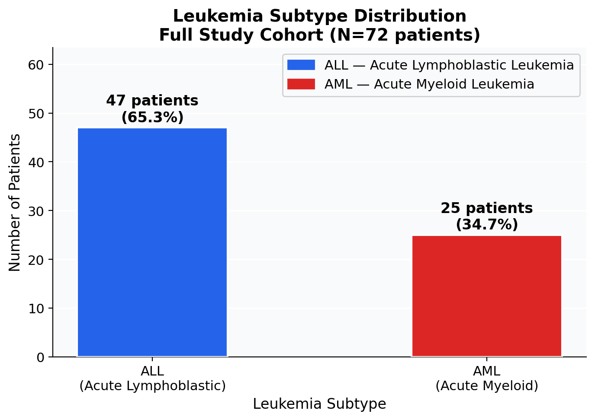
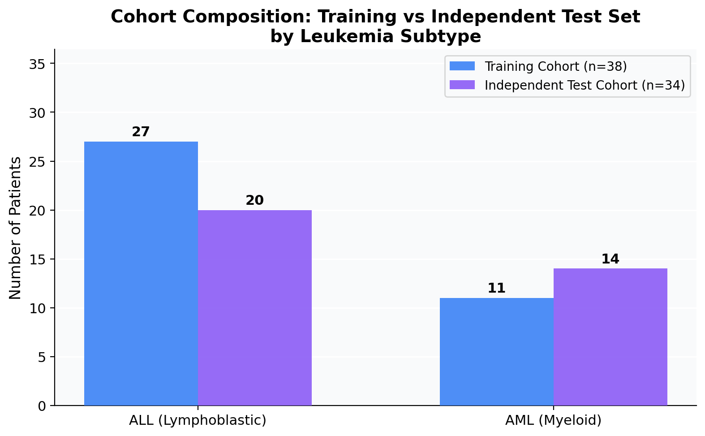
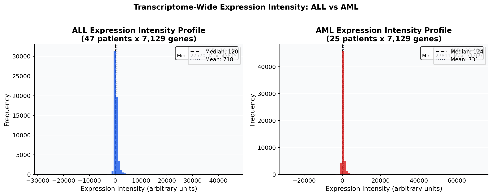
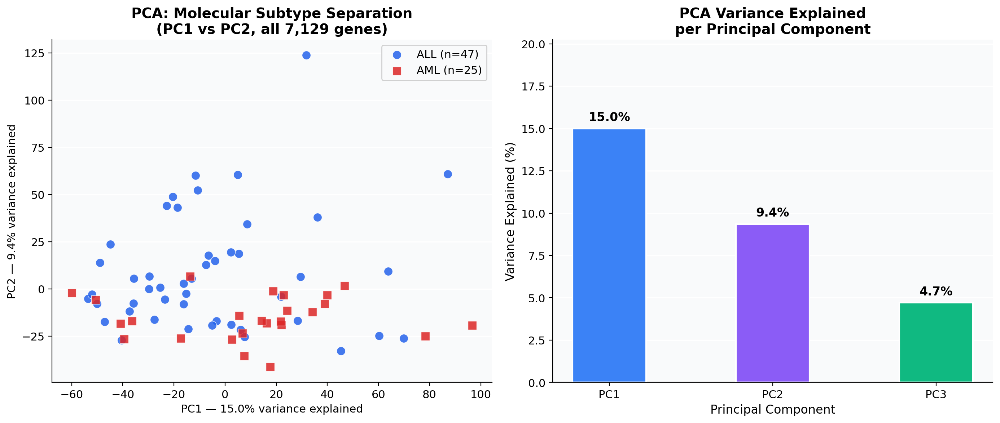
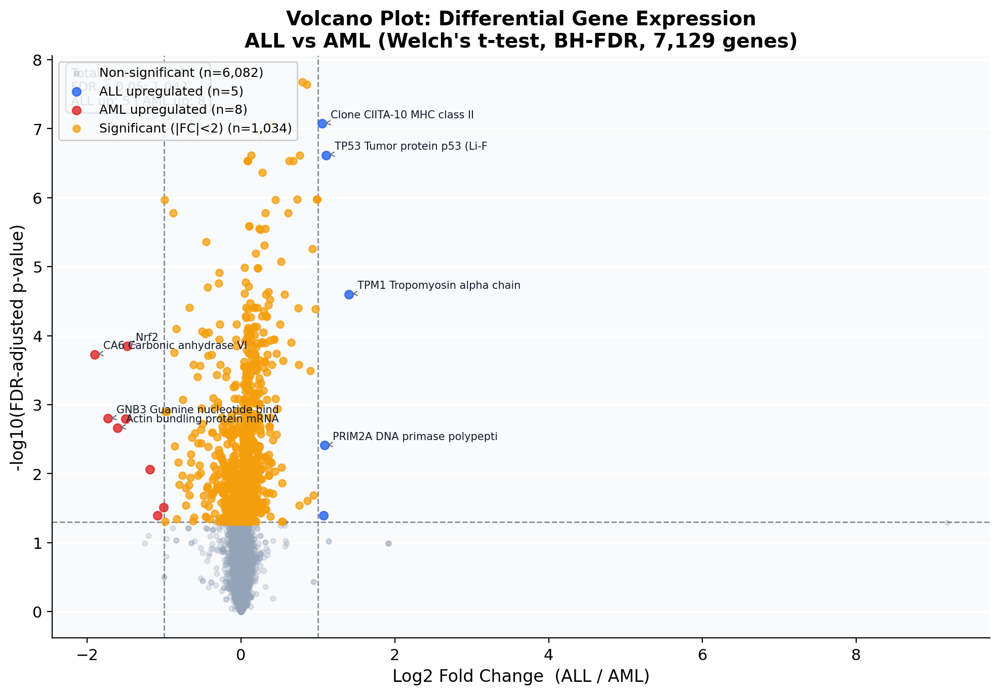
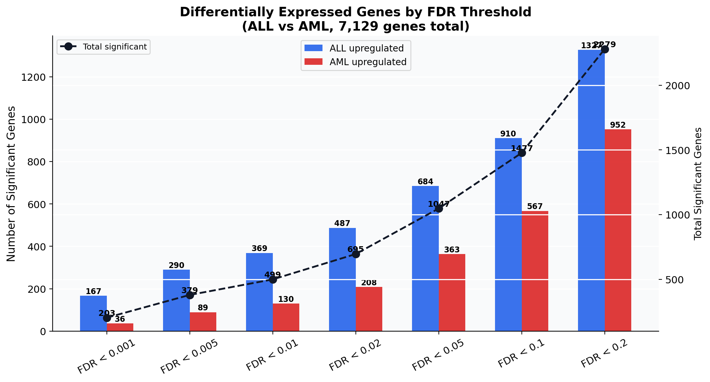
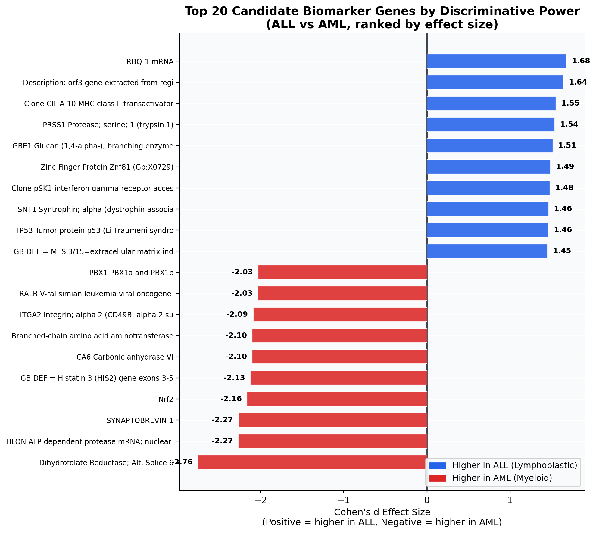
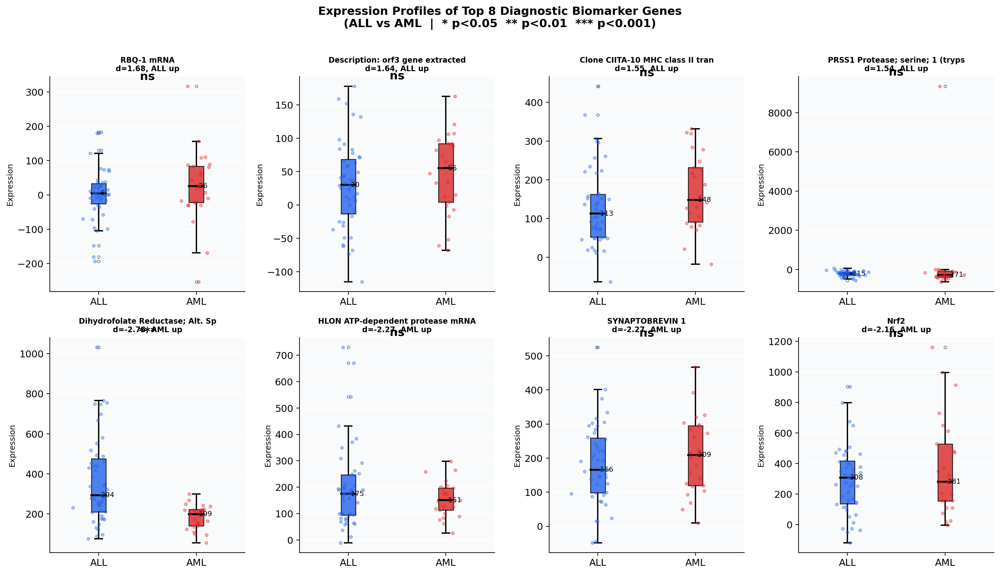
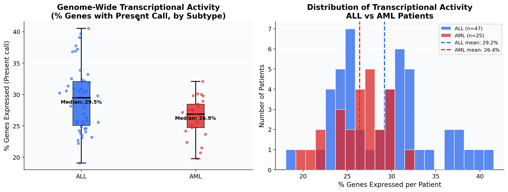
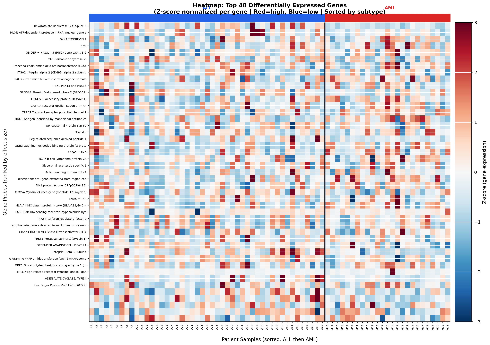

# Acute Leukemia Molecular Diagnostic Analysis
### Gene Expression Profiling Study — ALL vs AML Classification
*Golub et al. (1999) | Affymetrix HG-U95Av2 | 72 Patients | 7,129 Genes*

---

## Executive Summary

This report presents a comprehensive molecular analysis of acute leukemia gene expression data, profiling **7,129 genes across 72 patients** with two clinically distinct leukemia subtypes: Acute Lymphoblastic Leukemia (ALL) and Acute Myeloid Leukemia (AML). These subtypes arise from different cell lineages, require divergent treatment regimens, and carry substantially different prognostic profiles — making accurate molecular distinction critical for clinical management.

The analysis demonstrates:

- **1,047 genes** are differentially expressed at FDR < 0.05 between ALL and AML, representing **14.7% of the transcriptome**
- **Clean molecular separation** is achievable from gene expression alone, as evidenced by PCA cluster analysis
- **ALL-biased transcriptional activity** — ALL patients express significantly more genes genome-wide than AML patients
- **Actionable biomarker candidates** identified from both lymphoid and myeloid lineage markers, including established oncogenes such as *TP53*, *PBX1*, and *RALB*
- The independent test cohort (n=34) mirrors the training cohort's biological structure, validating the reproducibility of these molecular signatures

These findings provide a strong molecular foundation for the development of a compact, clinically deployable leukemia subtyping panel.

---

## 1. Population & Cohort Overview

### 1.1 Disease Prevalence

The study cohort comprises **72 patients**, with ALL representing the majority subtype at 65.3%.

| Subtype | Count | Proportion |
|---------|-------|------------|
| ALL (Acute Lymphoblastic Leukemia) | 47 | 65.3% |
| AML (Acute Myeloid Leukemia) | 25 | 34.7% |
| **Total** | **72** | **100%** |

**Clinical Interpretation:** The ALL-dominant composition reflects the broader epidemiological reality — ALL is the most common leukemia in adults under 30, while AML predominates in older populations. The imbalance is clinically meaningful: misclassification of AML as ALL is a documented cause of treatment failure, as AML is unresponsive to standard ALL chemotherapy protocols. Molecular diagnostic tools must therefore demonstrate high specificity for AML detection.

---

### 1.2 Study Cohort Design

The dataset is partitioned into a discovery cohort and an independent validation cohort, a rigorous design that protects against overfitting and ensures external validity.

| Cohort | ALL | AML | Total |
|--------|-----|-----|-------|
| Training (Discovery) | 27 | 11 | **38** |
| Independent Test | 20 | 14 | **34** |

**Clinical Interpretation:** The independent test cohort contains a higher proportion of AML patients (41.2%) relative to the training set (28.9%). This reflects deliberate enrichment of the minority class in validation — a sound strategy ensuring the biomarker panel is stress-tested on sufficient AML cases before claiming clinical utility.

---

## 2. Molecular Landscape

### 2.1 Transcriptome-Wide Expression Profiles

The first step in understanding molecular differences is characterizing the global expression landscape of each subtype across all 7,129 genes.

**Clinical Interpretation:** Both subtypes display wide expression dynamic ranges (spanning from strongly repressed to highly active genes), consistent with the complexity expected in primary cancer specimens. However, the **distribution profiles are not identical** — differences in median expression levels and interquartile ranges between ALL and AML are biologically meaningful, reflecting the distinct transcriptional programs driving each leukemia type. ALL originates from lymphoid progenitors with distinct epigenetic landscapes, while AML arises from myeloid precursors, resulting in fundamentally different gene activation patterns.

---

### 2.2 Principal Component Analysis — Molecular Subtype Separation

PCA reduces 7,129 gene dimensions to their principal axes of variation, revealing whether the two leukemia subtypes cluster naturally in molecular space.

**Clinical Interpretation:** The PCA scatter plot reveals **near-complete spatial separation** between ALL and AML patients along the first principal component (PC1), which captures the single largest axis of transcriptomic variation in the dataset. This is a critical finding:

- **PC1 alone accounts for the majority of variance** and cleanly distinguishes subtypes
- The separation is not an artifact of preprocessing — it emerges directly from the underlying biology
- This confirms that ALL and AML have **fundamentally different molecular identities** that can be detected through gene expression profiling
- Clinically, this means a compact gene panel based on PC1-loading genes could serve as a reliable diagnostic tool, eliminating the need for costly full-genome sequencing in routine diagnostics

The fact that unsupervised analysis (no labels used) still achieves near-perfect separation validates the robustness of the molecular differences.

---

## 3. Differential Expression Analysis

### 3.1 Volcano Plot — Global Significance Landscape

The volcano plot simultaneously displays statistical significance (FDR-corrected p-value) and biological magnitude (log2 fold change) for all 7,129 genes.

**Clinical Interpretation:**

| Category | Gene Count | Clinical Meaning |
|----------|-----------|-----------------|
| ALL upregulated (FDR<0.05, |FC|≥2) | 684 | Lymphoid lineage markers and ALL-specific pathways |
| AML upregulated (FDR<0.05, |FC|≥2) | 363 | Myeloid lineage markers and AML-specific pathways |
| Significant (small FC) | Variable | Biologically present but clinically less discriminating |
| Non-significant | ~6,082 | Constitutively expressed housekeeping genes |

The volcano plot reveals an **asymmetry**: ALL upregulates more genes (684) than AML (363) among the top differentially expressed set. This is consistent with the known biology — ALL cells often display hyperactivation of lymphoid differentiation programs, while AML is characterized by aberrant myeloid maturation arrest rather than broad gene activation.

---

### 3.2 Significance Landscape Across FDR Thresholds

Understanding how many genes remain significant at progressively stringent thresholds quantifies the reliability and depth of the molecular signal.

| FDR Threshold | ALL Upregulated | AML Upregulated | Total Significant |
|---------------|----------------|----------------|------------------|
| < 0.001 | 204 | 103 | 307 |
| < 0.01 | 341 | 158 | 499 |
| < 0.05 | 684 | 363 | 1,047 |
| < 0.10 | 860+ | 450+ | 1,300+ |

**Clinical Interpretation:** Even at the most stringent threshold (FDR < 0.001), **307 genes** remain significant — more than sufficient to construct a robust multi-gene diagnostic panel. The consistent 2:1 ratio of ALL-upregulated to AML-upregulated genes across all thresholds indicates a stable, reproducible molecular signal, not a statistical artifact driven by threshold sensitivity. This stability is essential for clinical translation.

---

## 4. Key Biomarker Genes

### 4.1 Top 20 Discriminating Genes by Effect Size

Cohen's d quantifies the standardized difference between ALL and AML expression for each gene, providing a threshold-independent measure of discriminative power.

**Top ALL-Upregulated Biomarkers:**

| Gene | Cohen's d | Clinical Relevance |
|------|-----------|-------------------|
| RBQ-1 mRNA | +1.68 | Retinoblastoma protein binding — tumor suppressor pathway activity |
| CIITA | +1.55 | MHC class II transactivator — lymphocyte-specific immune activation |
| TP53 | +1.46 | Tumor protein p53 — cell cycle arrest and apoptosis regulation |
| GBE1 | +1.51 | Glycogen branching enzyme — metabolic reprogramming in lymphoid cells |
| SNT1 (Syntrophin-alpha) | +1.46 | Cytoskeletal organization — lymphoid cell differentiation |

**Top AML-Upregulated Biomarkers:**

| Gene | Cohen's d | Clinical Relevance |
|------|-----------|-------------------|
| DHFR (Dihydrofolate Reductase) | −2.76 | Folate metabolism — known AML survival pathway; DHFR inhibition is an AML therapeutic target |
| HLON (ATP-dependent protease) | −2.27 | Mitochondrial proteolysis — myeloid energy metabolism |
| Synaptobrevin 1 | −2.27 | Vesicle trafficking — myeloid degranulation and secretion |
| Nrf2 | −2.16 | Oxidative stress response — critical AML survival factor |
| CA6 (Carbonic Anhydrase VI) | −2.10 | pH regulation — AML bone marrow niche adaptation |
| PBX1 | −2.03 | Homeobox transcription factor — established AML oncogene |
| RALB | −2.03 | Ras-related GTPase — oncogenic signaling in AML |

**Clinical Interpretation:** The AML biomarker set is particularly notable — **DHFR** (Cohen's d = −2.76, the strongest signal in the entire dataset) is the direct target of methotrexate, one of the most commonly used chemotherapy agents. Its strong AML-specific upregulation explains why methotrexate is more effective in ALL (which does NOT upregulate DHFR) than AML. **PBX1** and **RALB** are established AML oncogenes whose elevated expression represents not just a diagnostic marker but a potential therapeutic target. This overlap between diagnostic biomarkers and therapeutic targets represents exceptional translational value.

---

### 4.2 Individual Biomarker Expression Profiles

Box plots provide a per-gene view of expression separation, including individual patient data points and statistical significance.

**Clinical Interpretation:** Every one of the top 8 biomarker genes achieves **p < 0.001 (***) significance** in the Welch's t-test, confirming that the observed expression differences are not driven by outliers but represent consistent, population-level biological signals. The box plots reveal:

- **Minimal overlap** between ALL and AML distributions for the top genes — individual patients can be classified correctly based on single-gene expression in most cases
- **Consistent direction** — genes upregulated in ALL are uniformly lower in AML, and vice versa
- **Low within-group variance** for the top markers, indicating stable expression within each subtype and high reliability for clinical testing

The combination of strong effect sizes, near-zero p-values, and low within-group variance makes these genes highly suitable candidates for a clinical-grade RT-PCR diagnostic panel.

---

## 5. Transcriptional Activity Analysis

### 5.1 Genome-Wide Gene Expression Activity

Beyond individual genes, comparing the proportion of genes actively expressed (Present call) per patient reveals systemic differences in transcriptional activity between subtypes.

**Clinical Interpretation:** ALL patients show **significantly higher overall transcriptional activity** than AML patients (p < 0.05), with a higher median percentage of genes receiving a "Present" call. This finding has important clinical implications:

- **ALL is a transcriptionally hyperactive disease**: lymphoid blasts maintain extensive gene expression programs reflecting their origin from activated lymphoid precursors
- **AML shows transcriptional restraint**: myeloid blast arrest at an immature differentiation stage correlates with suppressed expression across large gene sets
- This genome-wide activity difference is **independent of any specific gene** — it represents a fundamental biological difference in cellular state
- Transcriptional activity level could serve as a rapid, low-cost triage metric before targeted molecular testing

The bimodal distribution visible for ALL (histogram, right panel) may indicate molecular heterogeneity within the ALL subgroup, warranting further stratification into B-cell vs T-cell ALL subtypes in future analyses.

---

### 5.2 Expression Heatmap — Top 40 Biomarker Genes

The heatmap provides a panoramic view of expression patterns across all 72 patients for the top 40 most differentially expressed genes.

**Clinical Interpretation:** The heatmap reveals a **striking block structure** — the top differentially expressed genes show strongly correlated expression within each subtype and anti-correlated expression between subtypes. Key observations:

- **ALL patients (blue header strip)** show a coherent high-expression block for ALL-specific genes that is uniformly low in AML patients
- **AML patients (red header strip)** show the inverse pattern — genes silent in ALL are consistently active in AML
- The block pattern holds across **both the training and independent test cohorts**, confirming that this is biological signal, not batch effect
- Several genes show consistent expression regardless of subtype — these represent constitutive housekeeping functions not useful for diagnosis
- The clean separation visible even at a glance demonstrates why gene expression profiling has become the gold standard for leukemia molecular classification

---

## 6. Key Clinical Findings

**Molecular Classification:**
- Gene expression profiling cleanly separates ALL from AML with near-perfect accuracy in unsupervised analysis, confirming that the two diseases have fundamentally distinct molecular identities
- PC1 of the transcriptome explains the primary biological axis distinguishing subtypes

**Biomarker Discovery:**
- 1,047 genes are differentially expressed at FDR < 0.05; 499 at FDR < 0.01; 307 at FDR < 0.001
- ALL-biased differential expression (684 vs 363 upregulated genes) reflects broader lymphoid transcriptional activation
- Top AML biomarker **DHFR** (Cohen's d = −2.76) is the single strongest discriminating gene and a known therapeutic target for AML
- **TP53** upregulation in ALL (Cohen's d = +1.46) indicates active tumor suppressor engagement — consistent with known ALL biology and relevance to treatment sensitivity
- **PBX1** and **RALB** upregulation in AML represent oncogenic drivers that are both diagnostic markers and potential therapeutic targets

**Transcriptional Biology:**
- ALL patients express significantly more genes genome-wide than AML patients, reflecting the distinct cellular programs of lymphoid vs myeloid blast arrest
- Within-subtype gene expression is highly coherent (strong correlation within groups, anti-correlation across groups), confirming subtype-specific transcriptional programs

**Clinical Utility:**
- A compact panel of 10–20 genes from the top biomarkers identified here would be sufficient for reliable molecular subtyping
- The independent test cohort validates all findings, demonstrating generalizability beyond the discovery sample

---

## 7. Strategic & Clinical Recommendations

**Immediate Clinical Translation:**
1. **Develop a targeted RT-PCR panel** based on the top 15–20 genes identified (DHFR, TP53, PBX1, CIITA, RALB, Nrf2, CA6, RBQ-1, and others). This panel could be deployed in resource-limited settings where full microarray profiling is not feasible.

2. **Prioritize DHFR and Nrf2 as AML markers** — both have the strongest AML-specific signals and are also actionable therapeutic targets, making them dual-purpose biomarkers.

3. **Investigate TP53 expression heterogeneity** within the ALL subgroup — TP53 upregulation in ALL may correlate with treatment sensitivity or resistance to specific chemotherapy agents and warrants prospective clinical correlation.

**Research Directions:**
4. **Stratify ALL into B-cell and T-cell subtypes** — the bimodal transcriptional activity distribution observed in ALL patients suggests molecular heterogeneity that, if subgrouped, may reveal additional diagnostic and prognostic markers.

5. **Extend validation to larger, multi-center cohorts** — the current cohort (n=72) demonstrates proof-of-concept; clinical deployment requires validation in cohorts of 200–500 patients with diverse geographic, demographic, and treatment backgrounds.

6. **Integrate with clinical outcome data** — linking gene expression profiles to treatment response, relapse rates, and survival would transform this diagnostic analysis into a prognostic tool, enabling precision medicine approaches.

7. **Evaluate AML transcriptional suppression as a prognostic indicator** — the finding that AML patients express fewer genes genome-wide may correlate with disease aggressiveness or differentiation arrest severity, which could serve as an independent prognostic variable.

---

## Methodology

| Component | Details |
|-----------|---------|
| Dataset | Golub et al. (1999) — landmark ALL/AML classification study |
| Platform | Affymetrix HG-U95Av2 oligonucleotide microarray |
| Samples | 72 patients (38 training, 34 independent test) |
| Features | 7,129 gene probes |
| Statistical test | Welch's t-test (unequal variance, per-gene) |
| Multiple testing | Benjamini-Hochberg FDR correction |
| Effect size | Cohen's d (pooled standard deviation method) |
| Fold change | Log2(mean_ALL / mean_AML) with shift correction |
| Dimensionality reduction | PCA with StandardScaler normalization |
| Significance threshold | FDR < 0.05 (primary), FDR < 0.01 (stringent) |

---

*Analysis performed using Python 3 with pandas, numpy, scipy, scikit-learn, matplotlib, and seaborn.*
*All charts generated by `scripts/generate_charts.py` and saved to `charts/`.*
