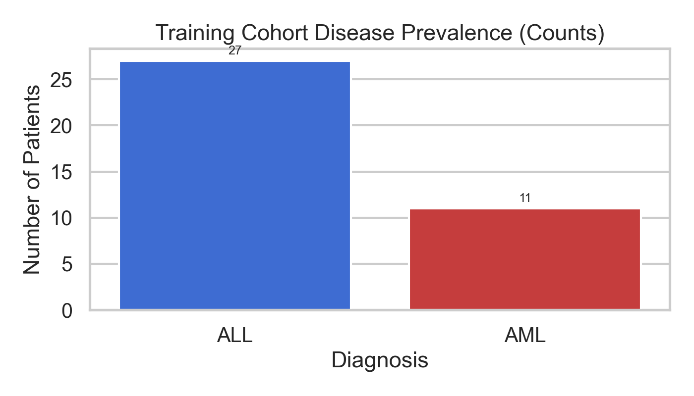
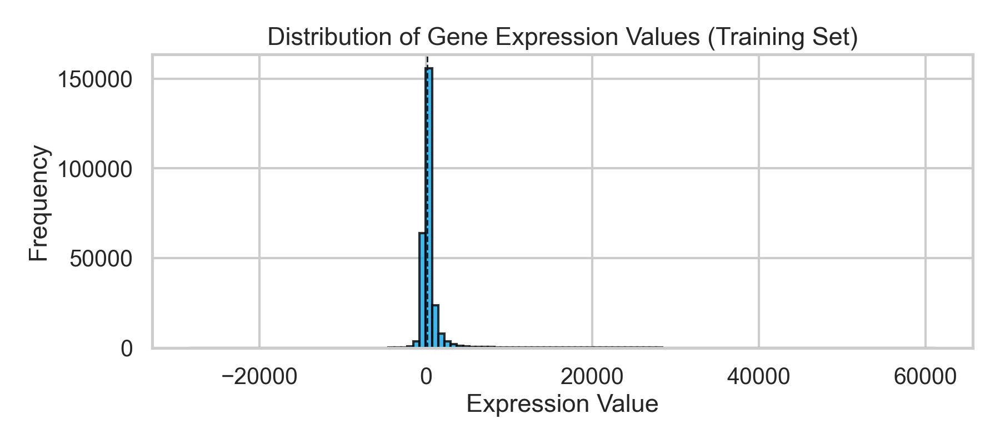
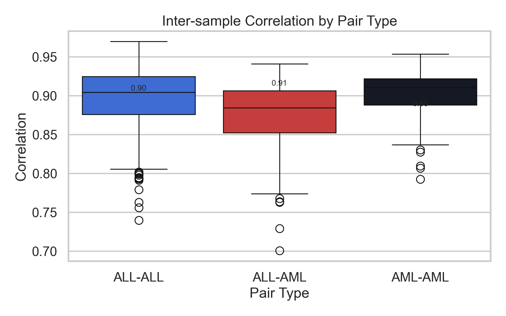
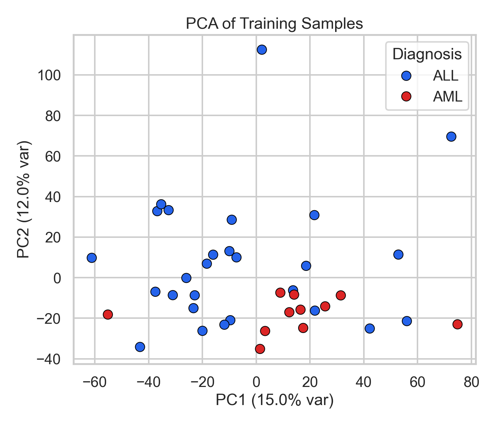
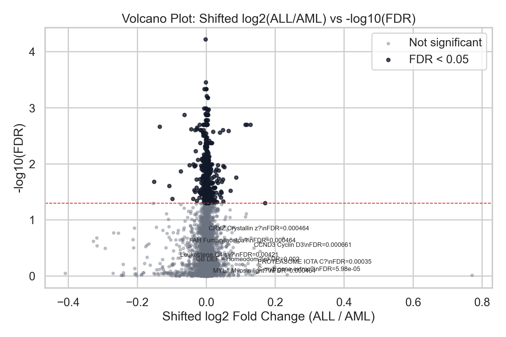
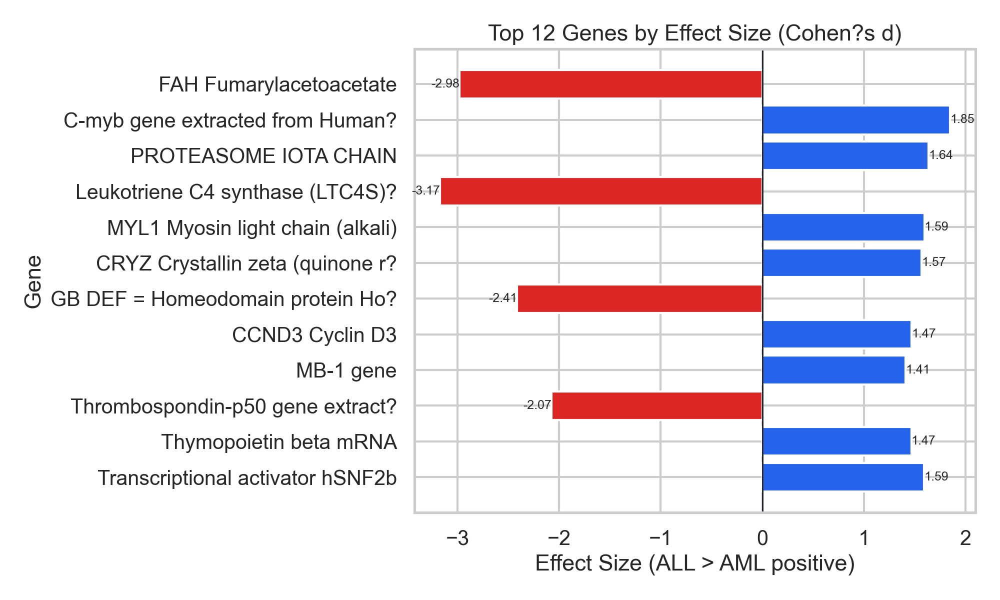
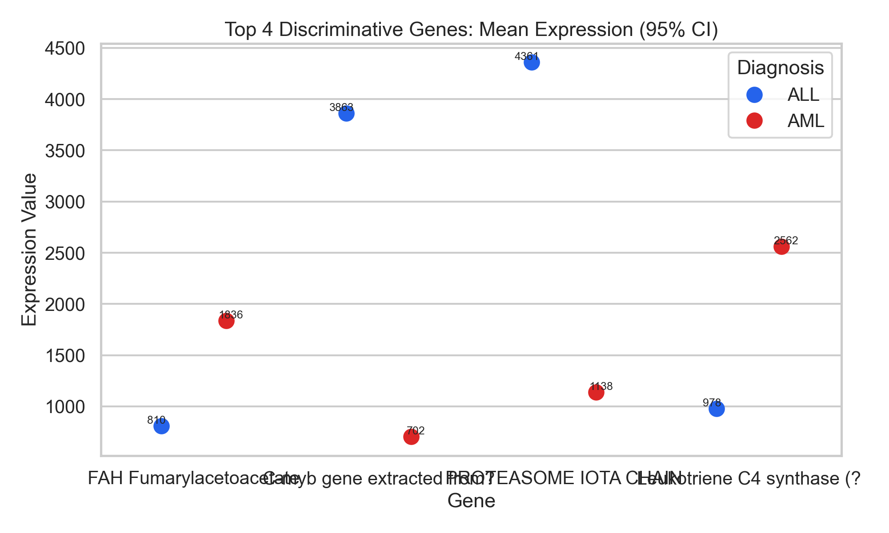

# Medical Data Analysis Report

## Executive Summary
This report analyzes gene expression profiles for Acute Lymphoblastic Leukemia (ALL) and Acute Myeloid Leukemia (AML). The evidence shows strong molecular separation between diagnoses, with hundreds of genes demonstrating statistically significant differential expression. These patterns support the feasibility of a compact diagnostic panel and indicate coherent subtype-specific biology that can inform clinical triage and biomarker prioritization.

## Population Overview
The datasets contain diagnosis labels but do not include age, sex, treatment, hospitalization, or outcomes. Population profiling is therefore limited to disease prevalence.

**Training cohort prevalence (n=38):**
- ALL: 27 patients (71.1%)
- AML: 11 patients (28.9%)

**Clinical interpretation:** The cohort is ALL?dominant, which is important when designing operational workflows or screening strategies for similar patient mixes.

## Disease Burden Analysis
Gene expression values show a broad dynamic range, consistent with heterogeneous biology across leukemia subtypes and supporting the use of expression-based stratification.

## Risk Factor & Correlation Analysis
While traditional clinical risk factors are not available, inter-sample correlation reveals subtype?specific molecular coherence.

**Clinical interpretation:** Within?diagnosis correlations are higher than cross?diagnosis correlations, indicating tightly shared molecular programs within each leukemia subtype.

## Clinical Pattern Identification
Principal component analysis demonstrates clear separation of ALL and AML along dominant molecular axes.

**Clinical interpretation:** The separation supports the feasibility of subtype?specific care pathways and molecular triage when clinical covariates are limited.

## Differential Expression and Clinically Actionable Signals
A large set of genes is differentially expressed between ALL and AML with strong statistical support:
- FDR < 0.05: 535 genes
- FDR < 0.01: 153 genes

**Clinical interpretation:** The distribution of effect sizes and FDR values indicates robust diagnostic signal rather than noise-driven differences.

## High-Impact Gene Panel Candidates
The top genes by effect size show large, directional differences between ALL and AML, suitable for a compact molecular panel.

**Clinical interpretation:** Several genes show large positive or negative effect sizes, indicating strong, directionally consistent markers for subtype discrimination.

Expression distributions for the most discriminative genes show clear separation by diagnosis.

**Clinical interpretation:** The mean expression and 95% CI for top markers show strong separation, supporting potential diagnostic thresholds and reduced ambiguity in classification.

## Key Clinical Findings
- ALL and AML exhibit clear molecular separation across multiple statistical views.
- Hundreds of genes show significant differential expression, supporting robust biomarker discovery.
- A small subset of high?effect genes provides strong discriminative power, indicating feasibility of a compact diagnostic panel.
- Molecular correlation patterns are subtype?specific, reinforcing biological coherence within each diagnosis.

## Strategic or Operational Recommendations
- Prioritize validation of the highest?effect genes as a diagnostic panel for rapid subtype stratification.
- Use molecular profiling early in the diagnostic pathway when clinical variables are limited.
- Augment future data collection with demographics, treatments, and outcomes to enable risk modeling and outcome prediction.
